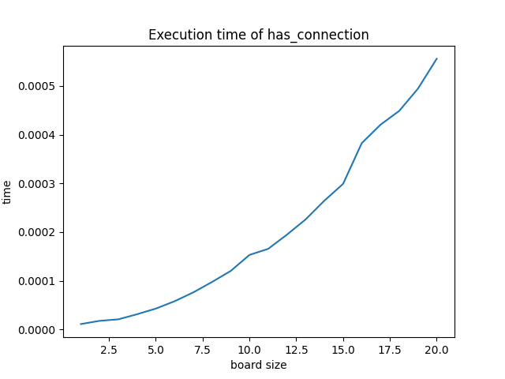
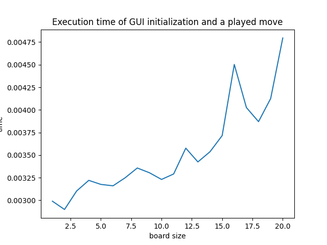
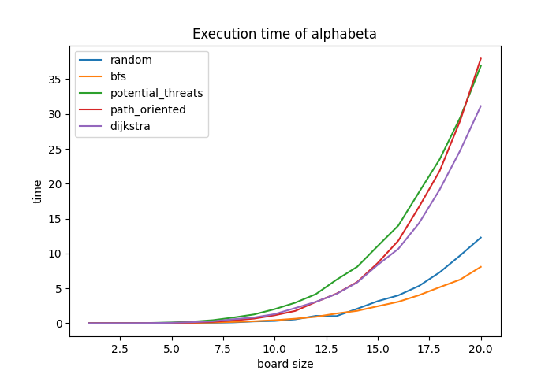

# PDP 2025

The repository contains three main directories :

- `<project_name>/`: The project source code.
- `reports/preliminary`: The preliminary report's code (LaTeX).
- `reports/final`: The final report's code (LaTeX).

# Authors

- KUSTERS Timon
- HERR Mariano
- ROCHETEAU Yohann
- GUITARD Paul
- HUBINCU Morgan

## Installation

Execute the following commands from the /hex-1 repertory to install the project :

```bash
sudo apt install libgirepository1.0-dev gcc libcairo2-dev pkg-config python3-dev python3-venv gir1.2-gtk-4.0 # gui
python3 -m venv .venv # create the virtual environment
source .venv/bin/activate # activate the virtual environment
pip install -e ./ # install the project dependencies
```

The virtual environment can be disabled with :

```bash
deactivate
```

## Usage

Execute the following commands from the /hex-1 repertory with the virtual environment enabled :

```bash
hex <options> # launch the game
pytest # launch the tests (and coverage)
```

## User Manual

### Options

The program can be started with different options that each serve its own purpose.

The list of the available options can be displayed by launching the program with the help option (```hex -h```)
It also shows the types and ranges of values expected for each option.

Some options are used to modify the values of a certain required parameters
(like --size to specify the board's size, 11 by default)

Other options are optionnal and disabled by default (swap, blitz, ai, etc.)

Launching the program without any specified option fetches the default configuration
from the /hex1/hex/config.checkersrc file.

### Cli

The program launched with the default game configuration will display the game in the terminal as text.
You will be able to see a representation of the board, as well as the histories of the done and undone moves and the two players's timers, if enabled.

The program will wait for an input.
After each move, the display is refreshed with the current board, histories and timers, and the current player will be asked for an input.
The game is over when a player has won, given up or that his timer has passed.

Other than playing a move, there are msicellanious commands available for the player to use (like 'help' or 'display' for instance).

### GUI

Launch the game with the GUI option (-g) will generate a graphical user interface instead of displaing the game on the terminal.
The player will be able to 'navigate' on program from a main menu.

Starting a new game will open a sub menu that will asks for the same game options that can be specified from the terminal.
Specifying options when launching the program will set them as selected in this sub menu but they can still be modified.
For instance, launching the game with ```hex -g --swap``` and then starting a new game will show the 'swap' box as checked in the new game parameters sub menu, but it can still be unchecked to disable it before actually starting the game.

From the main game window, the user can see the current player, the histories and the board, similarly as the cli display.
A move can be played by clicking on a board's empty cell, and it will update the display.
Furthermore, there are four buttons on the bottom of the window that can be used to perform an 'undo' or 'redo', as well as showing a hint or opening the pause menu.

### AI

When the game is started with one of the two players as an AI,
wether with a cli or a gui, the AI will play the moves of the designated player with the choosen parameters (search algorithm, heuristic and search times).

For instance, the following command will launch the game with the O player set as AI and a max search time of 5 seconds:

```hex --ai O --ai-time 5```

The user won't be able to interat with the program as long as it is playing.

When the two players are AIs, the user will have to wait for the end of the game to be able to interact with the program.

## Performances

### Time Performances

These three figures show that our algorithms scale quadratically with the dimension of the board.
<figure>
    
    <figcaption>Execution time of has_connection in seconds on every size of boards. (3 experiments)</figcaption>
</figure>

<figure>
    
    <figcaption>Execution time of the initialization of the GUI followed by a display refresh caused by a played move in seconds on every size of boards. (3 experiments)</figcaption>
</figure>

<figure>
    
    <figcaption>Execution time of alphabeta search in seconds with every heuristic on every size of boards. (3 experiments)</figcaption>
</figure>

Two profiling reports (profiling-alpha-beta.txt and profiling-mcts.txt) show that the connection checking algorithm is responsible of 80% of the AI search time.

### AI Performances

Winrate Table (as percentages):
| Algorithm          | random_exploration   | alpha_beta   | mcts   |
|--------------------|----------------------|--------------|--------|
| random_exploration | -                    | 0.0%         | 0.0%   |
| alpha_beta         | 100.0%               | -            | 0.0%   |
| mcts               | 100.0%               | 100.0%       | -      |

Parameters: Board size = 5, max_reflexion_time = 20s, max_depth = 3, heuristic = Dijkstra, calculated on 5 games.


Alpha-Beta Heuristic Winrate Table (as percentages):
| Heuristic         | random   | bfs    | potential_threats   | path_oriented   | dijkstra   |
|-------------------|----------|--------|---------------------|-----------------|------------|
| random            | -        | 0.0%   | 33.3%               | 33.3%           | 16.7%      |
| bfs               | 100.0%   | -      | 50.0%               | 0.0%            | 50.0%      |
| potential_threats | 66.7%    | 50.0%  | -                   | 0.0%            | 50.0%      |
| path_oriented     | 66.7%    | 100.0% | 100.0%              | -               | 0.0%       |
| dijkstra          | 83.3%    | 50.0%  | 50.0%               | 100.0%          | -          |

Parameters: algorithm = alpha_beta, board size = 7, max_reflexion_time = 20s, max_depth = 3, calculated on 6 games, after each games algorithms switches sides.

How to Read: winners on rows, opponent on columns,
    So we can read that alpha beta wins 100% of the time versus random_exploration